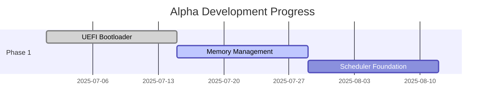

# Serix Kernel

[](https://www.gnu.org/licenses/gpl-3.0)

[](https://github.com/yourusername/serix)


**Secure Rust Implementation of unIX** - A next-generation microkernel combining UNIX philosophy with Rust's safety guarantees

```rust

// Serix's core principle

fn main() {

    safety::enforce();

    performance::maximize();

    legacy::modernize();

}

```

## Features (Proposed)

⚡ **Async-native hybrid scheduler** optimized for Intel hybrid cores  

🔒 **Capability-based security** with cryptographic handles  

📁 **POSIX-compliant** filesystem with modern extensions  

💨 **Blazing fast IPC** with approx. zero-copy optimization  

🧠 **Memory-safe architecture** with near zero-unsafe core

## Getting Started

### Prerequisites

- Rust nightly

- QEMU (≥ 7.0)

- UEFI-compatible hardware/emulator

### Build & Run

```bash

# Clone repository

git clone https://github.com/yourusername/serix.git

cd serix

# Build kernel

cargo build --target x86_64-serix-unknown-uefi

# Run in QEMU

./scripts/run-qemu.sh

```

## Documentation

📚 **[Architecture Design Document (ADD.md)](/docs/ADD.md)**  

- Detailed subsystem specifications  

- Security model overview  

- Hardware requirements

🗺️ **[Development Roadmap (ROADMAP.md)](/docs/ROADMAP.md)**  

- Phase-by-phase implementation plan  

- Current progress tracking  

- Target release dates

## Current Status



## Contribute

We welcome contributions! Please see our:

- [Contributor Guide](/CONTRIBUTING.md)

- [Discussions](https://github.com/yourusername/serix/discussions) for design conversations

## License

Licensed under:

- [GNU GPL v3
](/LICENSE)

---

> "UNIX philosophy with Rust's safety guarantees"  

> - Serix Mantra

**Follow our development journey** on [X @SerixKernel](https://x.com/SerixKernel)
