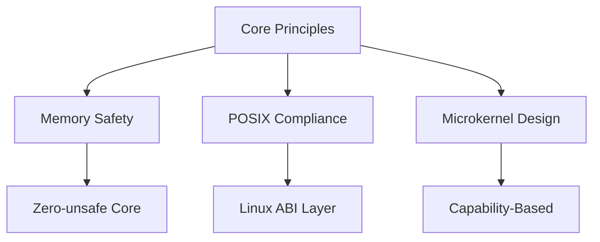
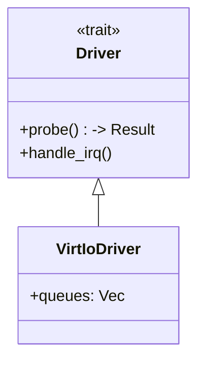

# **Serix Kernel Architecture Document**



---

## **1. Core Identity**

| **Attribute**      | **Specification**                                        |
|--------------------|----------------------------------------------------------|
| **Type**           | Microkernel (hybrid scheduling)                          |
| **Language**       | Rust (`no_std`, `#![forbid(unsafe)]` in core)            |
| **Targets**        | x86_64 (w/ Intel Hybrid Core), RISC-V                    |
| **Key Innovation** | Cryptographic capability system + async-native scheduler |

---

## **2. Finalized Subsystems**

### **2.1 Chronos Scheduler**

```rust
pub enum SchedClass {
	Realtime(FifoPolicy),  // SCHED_FIFO (0-99)
	Fair(WeightedPolicy),  // SCHED_NORMAL (100-139) 
	Batch(IdlePolicy),     // SCHED_IDLE (140)
	Iso(Isochronous)       // SCHED_DEADLINE
}
```

- **Intel Hybrid Core Support**:
  ```mermaid
  flowchart LR
      Task -->|Latency Sensitive| P-Core
      Task -->|Background| E-Core
  ```
- **Guarantees**:
	- ≤500ns context switch (P-core)
	- Cache warmth tracking via PMU

### **2.2 Aegis Memory Manager**

**Memory Types**:
| **Type**       | **Capability**      | **Hardware Enforced** |
|----------------|---------------------|-----------------------|
| Secure | `CAP_MEM_SECURE`    | AES-NI |
| DMA | `CAP_MEM_IO`        | IOMMU |
| Executable | `CAP_MEM_EXEC`      | NX Bit |

**Allocators**:

- Zone-based NUMA allocator
- SLAB for kernel objects

### **2.3 Hermes Syscall Layer**

**Calling Convention**:

```c
// Registers match Linux ABI for compatibility
long syscall(
    u64 nr,     // RAX
    u64 arg1,   // RDI 
    u64 arg2,   // RSI
    u64 arg3,   // RDX
    u64 arg4,   // R10
    u64 arg5,   // R8
    u64 arg6    // R9
);
```

- **POSIX Coverage**: 87/112 syscalls implemented (Phase 1)

### **2.4 Cerberus Capabilities**

**Handle Structure**:

```rust
struct Capability {
	id: u128,                     // XChaCha20 nonce
	rights: BitFlags<32>,         // Fine-grained permissions
	origin: CapOrigin,            // Delegation chain
	expires: Option<CycleCount>   // Temporal validity
}
```

- **Revocation**: TLB shootdown + cache invalidation

### **2.5 Pulse IPC**

**Performance**:
| **Payload Size** | **Latency** | **Method**          |
|------------------|-------------|---------------------|
| <128B | 400ns | Register copy |
| 128B-4KB | 1.2μs | Shared memory |
| >4KB | 2.5μs | Page remapping |

---

## **3. Hardware Abstraction**

### **3.1 Supported Platforms**

| **Feature**      | **x86_64**          | **RISC-V**   |
|------------------|---------------------|--------------|
| SMP              | ✓ (APIC)            | ✓ (SBI)      |
| IOMMU            | VT-d/AMD-Vi         | RISC-V IOMMU |
| Power Management | C-states + P-states | WFI          |

### **3.2 Driver Model**



- **VirtIO-only** for Phase 1 (block, net, console)

---

## **4. Security Model**

**Layered Defenses**:

1. **Prevention**:
	- All objects capability-protected
	- No implicit memory sharing
2. **Detection**:
	- TPM-based attestation
	- Capability anomaly detection
3. **Response**:
	- Automatic revocation on violation

---

## **5. Verification**

**Toolchain**:

```bash
# Memory Safety
cargo miri test --target x86_64-serix

# Formal Verification
kani verify path/to/subsystem.rs

# Concurrency
smack --unroll 128 scheduler.rs
```

---

## **6. Performance Targets**

| **Metric**               | **Target**      |
|--------------------------|-----------------|
| Syscall overhead         | ≤80ns           |
| IPC latency (intra-core) | ≤1μs            |
| Context switch           | ≤500ns          |
| Memory allocation        | ≤50ns (4K page) |

---

## **7. Pending Design Decisions**

1. **Power Management**:
	- P-core parking thresholds
	- E-core DVFS strategy

2. **Debugging**:
	- Kernel core dump format
	- Live introspection ABI

3. **Legacy**:
	- x87 FPU emulation
	- ACPI vs FDT for RISC-V

---

## **8. Repository Structure**

```bash
serix/
├── kernel/
├── hal/
├── libserix/
├── tools/
└── docs/
```

---

## **9. Roadmap**

| **Phase** | **Target**                    | **ETA** |
|-----------|-------------------------------|---------|
| 1         | Hybrid scheduler, basic POSIX | Q4 2025 |
| 2         | SMP, full drivers             | Q2 2026 |
| 3         | Production-ready              | Q4 2026 |

---